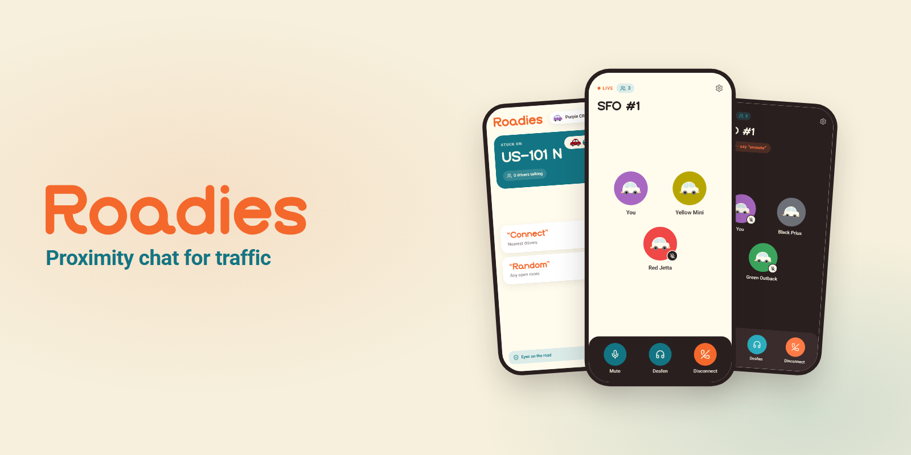
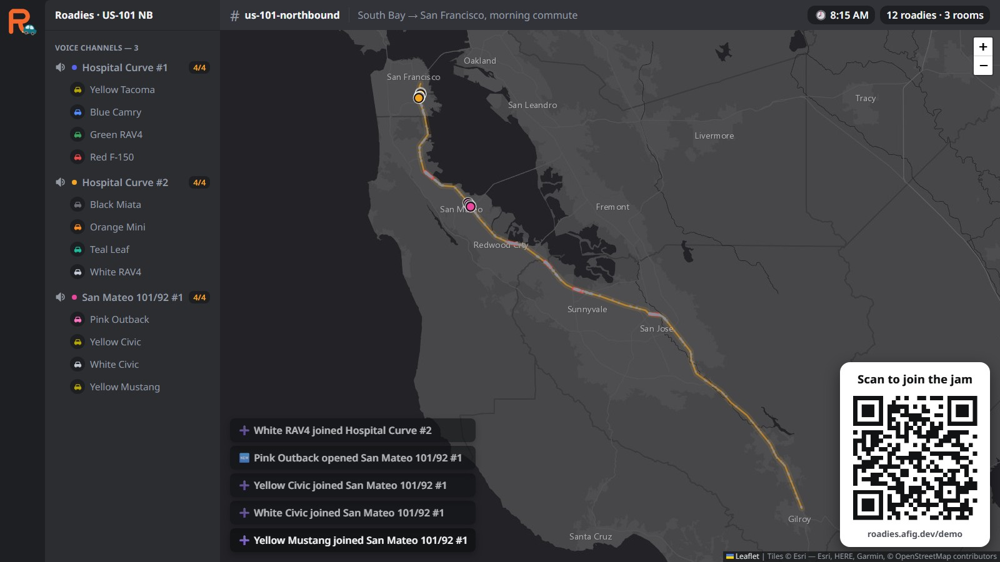

<p align="center">
  
</p>

<p align="center">
  <strong>Turn a traffic jam into a hangout.</strong><br>
  Hands-free voice chat for drivers stuck in the same jam.
</p>

<p align="center">
  <a href="https://roadies.afig.dev/demo"></a>
  <a href="https://github.com/a-Fig/Roadies/actions/workflows/ci.yml"></a>
  <a href="https://github.com/tthy-working/roadies"></a>
  
  
</p>

<p align="center">
  
</p>

Open the web app and you get a car name, like "Teal Civic", and a seat in a voice room with up to three of the drivers nearest you on the road. It works like a Discord voice channel for your stretch of highway, except you control it by voice: say **"mute"**, **"deafen"** or **"disconnect"** out loud and it happens, without touching the phone.

**Try it: [roadies.afig.dev/demo](https://roadies.afig.dev/demo)**

Built in ~8 hours for the [ShowerHacks by EF](https://luma.com/99857qk9?tk=jppxZQ) hackathon.

> [!NOTE]
> This repo is the complete app: web client, real-time server and tests. The brand, the animated intro and a mock-data frontend prototype started life at [tthy-working/roadies](https://github.com/tthy-working/roadies).

## Contents

- [Features](#features)
- [What you can say](#what-you-can-say)
- [Three pages](#three-pages)
- [The intro](#the-intro)
- [How it works](#how-it-works)
- [Run it locally](#run-it-locally)
- [Project structure](#project-structure)
- [Design system](#design-system)
- [Limits](#limits)
- [Credits](#credits)

## Features

- **Voice-first control.** Mute, deafen, disconnect, connect and random, all by speaking. The buttons do the same thing, for passengers.
- **Proximity rooms.** You land in a room of up to four drivers, matched by real distance along the road. Rooms follow traffic as it moves.
- **Discord-style voice state.** Mute, deafen and disconnect behave the way Discord users expect, with the same kind of sound cues.
- **Four languages.** Commands work in English, French, Spanish and Vietnamese.
- **Projector view.** A live map of the corridor, with cars colored by room and pulsing while they talk.
- **Simulated commute.** `/demo` puts you on a real stretch of US-101, so you can try it with nobody else on the road.
- **Tested at the audio level.** Unit tests, plus end-to-end tests with real browsers and fake microphones.

## What you can say

| Commands | What happens |
| --- | --- |
| "mute" | The room stops hearing you. |
| "unmute" | The room hears you again (and you're undeafened, like Discord). |
| "deafen" | You stop hearing the room; your mic is cut too. |
| "undeafen" | You hear the room again. |
| "disconnect" | You leave the room. The app keeps listening for the next two. |
| "connect" | You join the closest driver with a free seat, right now. |
| "random" | You jump to a random open room somewhere else on the road. |

"Don't mute me" does nothing: the whole utterance has to be the command, so normal conversation never triggers one. The same commands work in French, Spanish and Vietnamese ("coupe le micro", "apaga el micro", "tắt mic").

## Three pages

| Page | What it is |
| --- | --- |
| [`/`](https://roadies.afig.dev/) | The real app. It uses your phone's GPS and puts you in a room with whoever is actually near you. |
| [`/demo`](https://roadies.afig.dev/demo) | A simulated commute: you become a car at one of seven real choke points on US-101 (Hospital Curve, SFO, Palo Alto, …), inching north along the real highway. |
| `/presenter` | The big screen: a live map of the corridor with cars colored by room and pulsing while they talk, next to a Discord-style channel list and a QR code to join. |

<p align="center">
  
</p>

## The intro

<p align="center">
  
</p>

Two cars draw the "R" of the wordmark, pull in for a quick chat, then settle into the logo. It's an animated SVG built with [GSAP](https://gsap.com) from the Figma storyboard, so it stays sharp on every screen size. Tapping skips it. The keyframes live in [`web/src/intro/frames.ts`](web/src/intro/frames.ts).

## How it works

```
 phone (web app) ──WebSocket: hello, button presses──▶ Node server ◀── Google Speech-to-Text
       │                                                    │   ▲
       └──────── voice (WebRTC) ──▶ LiveKit room ◀── hidden listener (one per room)
```

**The server hears you even when the room can't.** The obvious way to mute is to stop sending your mic. Then nobody could hear you say "unmute". So the phone always publishes its mic, and "muted" means LiveKit's track-subscription permissions allow exactly one subscriber: a hidden listener participant the server runs in every room. "Disconnect" works the same way: you leave the roster and hear nothing, but the listener still hears you say "connect".

**Recognizing one word in a car.** The listener feeds each driver's audio (16 kHz) through an energy-based speech gate and opens one short Google Speech-to-Text stream per utterance, with the seven command words boosted as phrase hints. It checks Google's top five guesses, but a lower guess only counts when the top guess is short (two words at most, or no longer than the command), so "mute the radio" never becomes "mute".

**One path for buttons and voice.** A tap and a spoken command go through the same state machine on the server, which owns every driver's room and mute/deafen state and pushes the result to the phone. The phone never decides anything, so buttons and voice can't disagree.

**Matchmaking.** You join the room whose nearest active driver is closest to you (haversine distance) and has a free seat out of four; otherwise you open a new room, named after the nearest landmark (`Hospital Curve #2`). Rooms are sticky as traffic moves. A driver left alone for 15 seconds is merged into the closest open room.

**Tested at the audio level.** 108 Vitest tests cover matchmaking, the command parser in all four languages, the speech gate and the whole server driven by a fake clock. 13 Playwright tests run real Chromium "phones" with fake microphones through a local LiveKit server and check that mute, deafen and disconnect really cut you off from the room while the hidden listener still receives your mic. GitHub Actions runs all of it on every pull request.

**Stack:** TypeScript end to end (Node 22, npm workspaces), React + Vite, LiveKit for voice (LiveKit Cloud in production), Google Speech-to-Text, Leaflet for the map, one Google Cloud Run instance with all state in memory.

## Run it locally

You need Node 22 or newer, Git, and ports 5173, 7880 and 8080 free. On Windows, use Git Bash. On macOS, run `brew install livekit` first.

1. Install and start everything:

   ```sh
   git clone https://github.com/a-Fig/Roadies.git
   cd Roadies
   npm install
   npm run dev
   ```

   This starts three processes in one terminal: a local LiveKit voice server on port 7880 (downloaded into `.livekit/` on first run on Linux and Windows), the app server on 8080, and the web app on 5173. It needs no accounts, API keys or `.env` file. It's ready when Vite prints its local URL.

2. Open the projector at <http://localhost:5173/presenter?key=demo>. Then open <http://localhost:5173/demo> in two or three more tabs, tap the intro to skip it, and tap **Connect**. Allow the microphone when the browser asks. Every tab is a separate car; the first four land in the same room at Hospital Curve, and the projector shows them there.

3. Your local copy has no speech recognition, so type what a driver says instead. Demo cars join muted; unmute one by name (pick any name from the projector's channel list):

   ```sh
   curl -X POST localhost:8080/dev/say -H 'content-type: application/json' \
     -d '{"name":"Teal Civic","text":"unmute"}'
   ```

   That tab plays the unmute sound and its muted badge disappears in every tab. Try `deafen`, `disconnect` and `connect` the same way.

4. Optional: `npm run fake-phones -- 12` adds twelve phones that beep instead of talking, to fill the map.

To run the tests: `npm test` (unit), and `npx playwright install chromium` once, then `npm run e2e` (end to end; stop `npm run dev` first so the tests start fresh servers).

To use real phones and real voice recognition you need HTTPS, a LiveKit Cloud project and Google Speech-to-Text: see [docs/deploy.md](docs/deploy.md).

| Command | What it does |
| --- | --- |
| `npm run dev` | Local LiveKit, app server and web app together |
| `npm run dev:app` | App server and web app only (use with LiveKit Cloud) |
| `npm run fake-phones -- 12` | Adds twelve fake phones that beep instead of talking |
| `npm test` | Unit tests |
| `npm run e2e` | End-to-end tests |
| `npm run typecheck` | Type-checks all three packages |
| `npm run build` | Builds the web app into `web/dist` |

## Project structure

```
Roadies/
├── shared/src/               Pure logic shared by server and web
│   ├── matchmaker.ts         Proximity rooms
│   ├── voice.ts              Mute/deafen rules and the command parser
│   ├── corridor.ts           The US-101 corridor and its choke points
│   └── protocol.ts           WebSocket message types
├── server/src/
│   ├── world.ts              Cars, rooms and messaging (no network I/O)
│   ├── hub.ts                WebSocket layer
│   ├── listener.ts           Hidden per-room LiveKit listener
│   ├── recognizer/           Speech gate and Google Speech-to-Text
│   └── tools/                Dev tooling such as fake phones
├── web/src/
│   ├── pages/                Join, YourJam, Drive, Presenter, Setup, Brand
│   ├── intro/                The animated logo intro
│   ├── lib/                  Voice, socket, wake lock, i18n and chimes
│   └── brand.css             Brand tokens
├── e2e/                      Playwright tests
├── deploy/                   Cloudflare proxy for the custom domain
└── docs/                     README images and deploy guide
```

## Design system

Brand and design by [@tthy-working](https://github.com/tthy-working). The tokens are CSS custom properties in [`web/src/brand.css`](web/src/brand.css), and the running app shows them at [`/brand`](https://roadies.afig.dev/brand).

| | Color | Hex | Used for |
| --- | --- | --- | --- |
|  | Orange | `#F4682C` | Logo and main actions |
|  | Teal | `#137584` | Jam card, active controls, speaking ring |
|  | Cream | `#FFFCEE` | Backgrounds |
|  | Ink | `#2A1F1F` | Text |

Headings use **Bepory** and body text uses **Roboto**.

> [!IMPORTANT]
> Bepory is licensed for personal use only, so it isn't in this repo. To see it, install it on your computer or place `Bepory.otf` in `web/public/fonts/`. Without it, headings fall back to Roboto. A commercial license is available from [Rantau Studio](https://rantaustudio.com/).

## Limits

- **Keep the app on screen.** Mobile browsers pause WebRTC when the tab goes to the background, for example behind Google Maps. Roadies holds a screen wake lock instead. Real background audio needs a native app (CallKit on iOS, a foreground service on Android); that's the next step.
- **Hackathon scope.** One server instance with everything in memory: no accounts, no moderation, no persistence, no scaling past one machine.
- **Phones in one room can cross-trigger.** Muted mics still reach the listener, so one person saying "unmute" next to several phones could unmute all of them.
- **Languages are unreviewed.** The French, Spanish and Vietnamese phrases haven't been checked by native speakers, and a French or Vietnamese recognizer catches English commands poorly.
- **Privacy.** Your audio reaches the server only to detect commands. It is never recorded.

## Credits

- **Built by** [Tyler Darisme](https://github.com/a-Fig) & [Opus5.5](https://www.anthropic.com/claude) (#1 model)
- **Brand, design and the original frontend prototype:** [@tthy-working](https://github.com/tthy-working), at [tthy-working/roadies](https://github.com/tthy-working/roadies)
- **Built with:** [LiveKit](https://livekit.io), [React](https://react.dev), [Vite](https://vite.dev), [GSAP](https://gsap.com), [Leaflet](https://leafletjs.com) and [Roboto](https://fonts.google.com/specimen/Roboto)
- **Sound cues** were stolen from [Discord](https://discord.com/) (please don't sue me)
